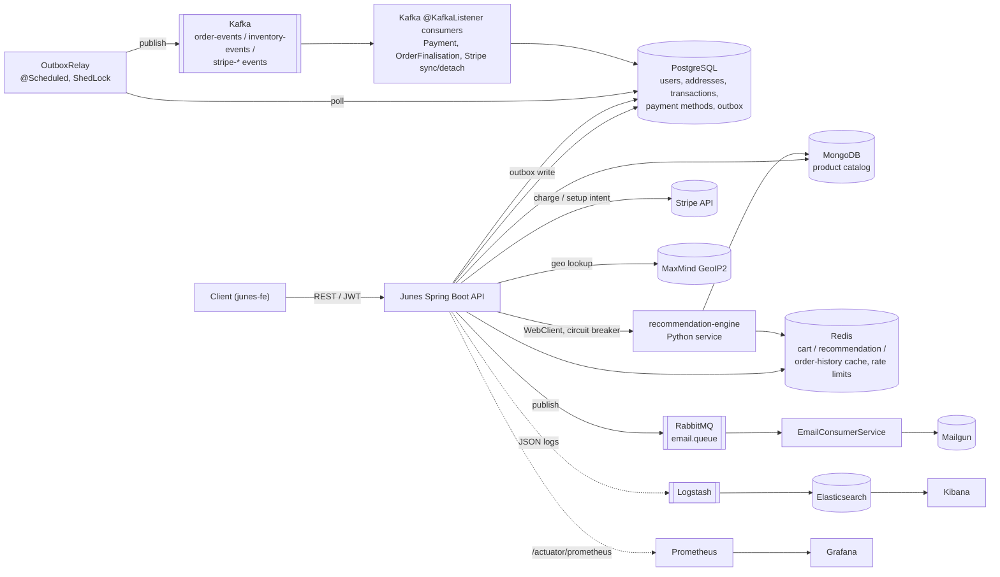
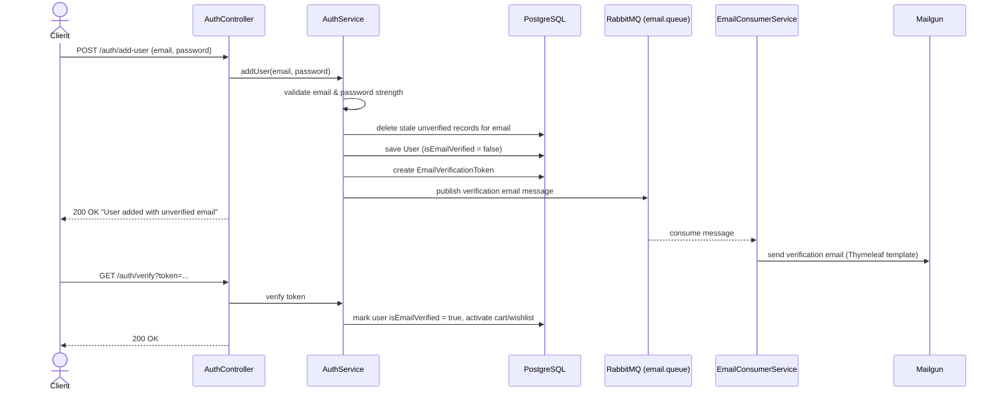
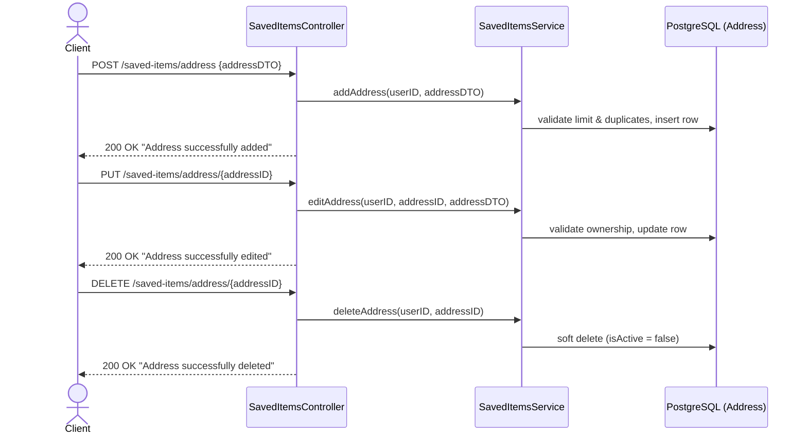
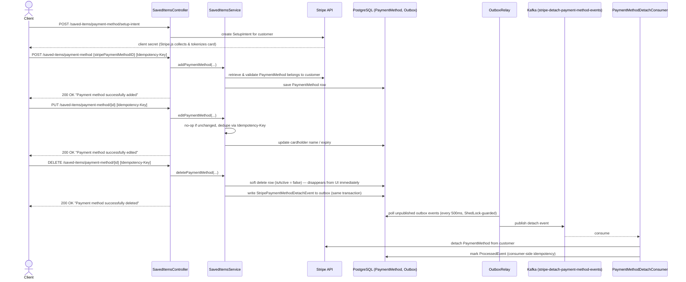
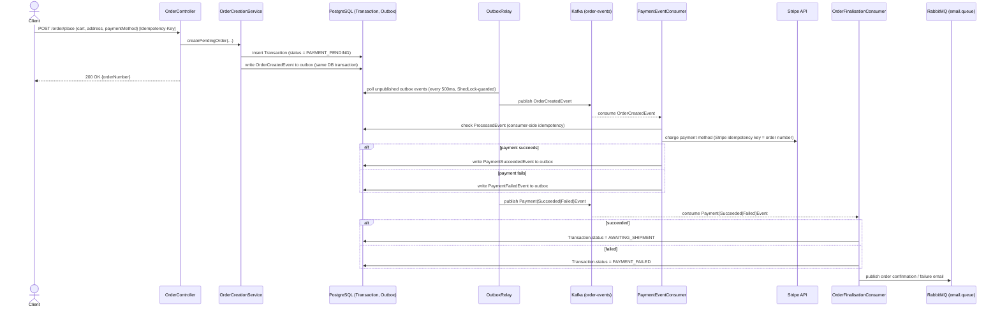

# Junes — Online Video Game Store (Backend)

Junes is a prototype e-commerce backend for an online video game store, built as a portfolio project to demonstrate production-style backend engineering patterns: event-driven order/payment processing, a transactional outbox, dual-database persistence, third-party payment integration, and a full local observability stack.

It is a **Spring Boot 3.3 / Java 17** REST API. The frontend lives in a sibling repo ([`junes-fe`](../junes-fe)), and product recommendations are served by a companion Python microservice ([`recommendation-engine`](../recommendation-engine)) called over HTTP.

> This is a dummy store — no real payments, emails, or user data are involved. Stripe runs in test mode, and all "production" credentials in this repo are local dev values.

## Table of contents

- [Tech stack](#tech-stack)
- [External integrations](#external-integrations)
- [Architecture at a glance](#architecture-at-a-glance)
- [Workflows](#workflows)
  - [User registration & email verification](#user-registration--email-verification)
  - [Address: add / edit / delete](#address-add--edit--delete)
  - [Payment method: add / edit / delete](#payment-method-add--edit--delete)
  - [Order placement](#order-placement)
- [Running the app](#running-the-app)
- [Accessing supporting services](#accessing-supporting-services)
- [Testing & code quality](#testing--code-quality)
- [Project structure](#project-structure)

## Tech stack

| Category | Technology |
|---|---|
| Language / runtime | Java 17 |
| Framework | Spring Boot 3.3 (Web MVC + WebFlux, Security, Validation, AOP, Actuator) |
| Relational data | PostgreSQL 15 + Spring Data JPA (users, addresses, transactions, payment methods, outbox/idempotency) |
| Document data | MongoDB 6 + Spring Data MongoDB (product catalog) |
| Caching / rate limiting | Redis 7 (cart cache, recommendation cache, order-history cache, Bucket4j token buckets) |
| Messaging (events) | Apache Kafka (order/payment/inventory/Stripe-sync events, transactional outbox pattern) |
| Messaging (email) | RabbitMQ (async email dispatch with a dead-letter queue) |
| Auth | Stateless JWT (`jjwt`), Spring Security filter chain |
| API docs | springdoc-openapi / Swagger UI |
| Mapping | MapStruct (entity ↔ DTO) |
| Resilience | Resilience4j (circuit breaker + retry around the recommendation engine call) |
| Scheduling / coordination | Spring `@Scheduled` + ShedLock (Postgres-backed distributed locks) for outbox relay & housekeeping jobs |
| Templating | Thymeleaf (transactional email templates) |
| Logging | Logback + Logstash encoder → ELK (Elasticsearch, Logstash, Kibana) |
| Metrics | Micrometer → Prometheus → Grafana, with Alertmanager |
| CI/CD | Jenkins (declarative pipeline, custom agent + controller images) |
| Containers | Docker / Docker Compose |

## External integrations

| Service | Used for | Called from |
|---|---|---|
| **Stripe API** | Customer/payment-method management, SetupIntents (card tokenization), charges | `service/payment/StripeService`, `StripePaymentGatewayService`, `service/payment/SavedItemsService` |
| **Mailgun** | Transactional email delivery (verification, password reset, order updates) | `service/email/EmailConsumerService`, consumed off `email.queue` |
| **MaxMind GeoIP2** | IP → geolocation enrichment for request/device context | `service/GeoLocationService` |
| **Recommendation engine** (sibling Python service, `recommendation-api`) | Personalized product recommendations, over WebFlux `WebClient` behind a Resilience4j circuit breaker + retry | `service/product/RecommendationService`, `config/RecommenderSystemClientConfig` |

All four are called synchronously except Stripe, whose async side effects (customer email sync, payment-method detach) also flow back in over Kafka topics `stripe-sync-events`, `stripe-detach-payment-method-events`, and `stripe-payment-method-sync-events`.

## Architecture at a glance



## Workflows

All sequence diagrams below reflect the actual outbox/idempotency pattern used in the code, not a simplified version of it.

### User registration & email verification

`POST /junes/api/v1/auth/add-user` → `AuthService.addUser`



### Address: add / edit / delete

`SavedItemsController` (`/junes/api/v1/saved-items/address*`) → `SavedItemsService`, backed directly by PostgreSQL — no outbox involved, since addresses have no external system to stay in sync with.



### Payment method: add / edit / delete

Card details never touch the Junes backend: the frontend collects them via Stripe Elements against a `SetupIntent`, and only the resulting Stripe `payment_method` ID is sent to us. Add/edit/delete are idempotent (`Idempotency-Key` header) and delete fans out to Stripe asynchronously via the outbox so the UI isn't blocked on a Stripe round trip.



### Order placement

`POST /junes/api/v1/order/place` → the flow spans a synchronous request/response plus two asynchronous Kafka consumers, tied together by the transactional outbox so the DB write and the Kafka publish never diverge.



## Running the app

### Prerequisites

- Java 17
- Docker + Docker Compose
- A sibling checkout of [`recommendation-engine`](../recommendation-engine) at `../recommendation-engine` (its Dockerfile is built as part of `docker compose up`)

### Steps

```bash
# 1. Start all infra dependencies (Postgres, MongoDB, Redis, RabbitMQ, Kafka,
#    the recommendation engine, and the ELK / monitoring stack)
docker compose up

# 2. Run the app itself (docker-compose.yml does not start the app — it connects
#    to the containers above via localhost)
./mvnw spring-boot:run

# 3. Stop infra when done
docker compose down
```

Other useful Maven commands:

```bash
./mvnw clean install                     # full build
./mvnw clean test                        # unit tests
./mvnw test -Dtest=ClassName             # single test class
./mvnw test -Dtest=ClassName#methodName  # single test method
```

Once running, the API is at `localhost:8080`, and interactive API docs are at:

```
localhost:8080/swagger-ui/index.html   # Swagger UI
localhost:8080/api-docs                # raw OpenAPI JSON
```

## Accessing supporting services

| Service | URL / command | Notes |
|---|---|---|
| **PgAdmin** | `localhost:5050` | Login with the credentials in `docker-compose.yml`. Manage the Postgres tables (users, addresses, transactions, payment methods, outbox). |
| **Mongo Compass** | run `mongodb-compass` | Manage product catalog documents. Connect using the Mongo credentials in `docker-compose.yml`. |
| **RabbitMQ management UI** | `localhost:15672` | Login with the credentials in `docker-compose.yml`. Inspect `email.queue`, `email.exchange`, and the dead-letter queue. |
| **Kafka** | broker at `localhost:9092` | No GUI is bundled; inspect topics with the CLI, e.g. `docker compose exec kafka kafka-topics --bootstrap-server localhost:9092 --list` or `kafka-console-consumer` to tail `order-events`. |
| **Redis** | `localhost:6379` | No GUI is bundled; use `redis-cli` or a tool like RedisInsight if you have one installed. |
| **Elasticsearch** | `localhost:9200` | No auth, local dev only. |
| **Kibana** | `localhost:5601` | Pre-provisioned `junes-logs-*` index pattern, plus two saved searches under **Discover > Open**: `Logs by Correlation ID` (filter with `correlationId: "<value>"` to trace one request end-to-end) and `Error & Warn Logs (All Services)`. App logs are shipped automatically via Logstash on `localhost:5044` — no manual setup. If Elasticsearch fails to start with a `vm.max_map_count` error (Linux only): `sudo sysctl -w vm.max_map_count=262144`. |
| **Prometheus** | `localhost:9090` | Scrapes `/actuator/prometheus` on `localhost:9404` every 15s — **the app must be running locally** (`./mvnw spring-boot:run`), since compose does not start the app itself. Check **Status > Targets** for the `junes-app` job. |
| **Grafana** | `localhost:3000` | Login `admin` / `admin` (local dev only). Dashboards **API Latency & Error Rate**, **JVM Health**, and **Kafka Consumer Lag** are provisioned automatically under the **Junes** folder. |
| **Alertmanager** | `localhost:9093` | Paired with Prometheus alerting rules under `monitoring/`. |
| **Jenkins** | `localhost:8090/jenkins` | CI pipeline defined in `Jenkinsfile`; builds against `docker-compose.app.yml`. |

## Testing & code quality

- Unit tests run with `./mvnw clean test`.

## Project structure

```
config/        Spring @Configuration classes (security, Kafka, Mongo, Redis, RabbitMQ, rate limiting, Stripe, etc.)
controller/    REST controllers
service/       business logic, split by domain: auth/, payment/, product/, cart/, email/, order/, consumer/, outbox/, cache/
model/         JPA @Entity and MongoDB @Document classes
repository/    Spring Data repositories (jpa/ and mongodb/)
dto/           request/, response/, event/, recommender/ subpackages
mapper/        MapStruct entity <-> DTO mappers
exception/     custom exceptions, handled centrally in config/GlobalExceptionHandler
util/          validators, JWT, Kafka event parsing, ID generation, housekeeping tasks
constant/      shared string/enum constants (e.g. KafkaConstants)
annotation/    custom annotations
```

## License

Licensed under the [Apache License 2.0](LICENSE).
